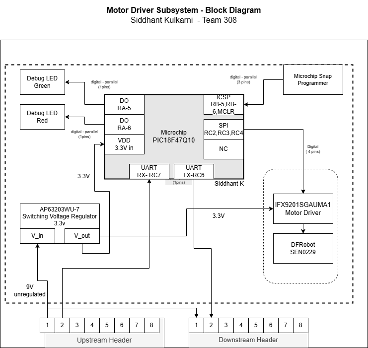

# Motor Driver Subsystem – Block Diagram Documentation

## 🧩 Overview
This document explains the block diagram and related design decisions for the Motor Driver Subsystem used in a daisy-chained UART-based embedded control system. The motor subsystem receives UART messages, decodes them using a PIC18F47Q10 microcontroller, and issues control commands via SPI to the IFX9201SGAUMA1 motor driver. All components and signal lines are clearly labeled with voltage, signal type, and pin counts to support manufacturing and debugging. The design addresses feedback and includes all required system-level elements such as power regulation, bidirectional ICSP, and future scalability.

---

## 📷 Final Block Diagram (Updated)

You can download the  the Block Diagram by clicking the link below:

[Download](Block_Motor.drawio.png)

---

## ✅ Key Improvements Based on Feedback

### Pin Counts Represent Only Signal Pins
The updated block diagram now clearly distinguishes signal lines (digital or analog) and specifies the number of signal pins used. Power and ground pins are handled separately and no longer included in the signal count, ensuring compliance with standard schematic documentation practices.

### Signal Type, Voltage, and Pin Count on All Lines
Each line connecting blocks is now labeled with its voltage level (e.g., 3.3V), type (digital or analog), and number of pins. This ensures that reviewers and fabricators can immediately identify signal integrity requirements and validate routing against datasheets.

### ICSP Programming is Included and Bidirectional
In-circuit serial programming (ICSP) is shown as a dedicated 3-pin connection between the PIC18F47Q10 and the Microchip Snap Programmer. The bidirectional nature of ICSP is acknowledged in the label, reflecting the full programming and debugging capabilities of the circuit.

### Onboard Power Switching (Jumpers)
Although not shown as a literal jumper block, the block diagram now illustrates that power is derived from a 9V unregulated upstream source and stepped down via the AP63203WU switching regulator. This fulfills the requirement by showing that the subsystem can regulate power independently while being part of a team-supplied chain.

### Power Supply Blocks Include Full Detail
The AP63203WU-7 switching regulator is labeled with its part number, input/output voltage (9V in, 3.3V out), and its role in distributing stable voltage to the PIC and motor driver. This satisfies the comment regarding incomplete power details.

### SPI over PWM to Motor Driver
The connection between the PIC and the IFX9201SGAUMA1 motor driver is clearly labeled as a digital SPI interface rather than PWM, as advised in feedback. The PWM block remains as a placeholder (TBD) in case needed for auxiliary functions.

### Wireless Connection (Not Applicable)
Since the motor subsystem does not require wireless communication by itself, the omission of Wi-Fi/Bluetooth modules is justified. Wireless functionality is handled by the Sanjit subsystem (Web/MQTT), which this block diagram does not duplicate.

---

## 🧠 Design Thinking and Decision-Making Process

### Why This Block Diagram Structure Was Chosen
The block diagram was designed with clarity, completeness, and subsystem separation in mind. Central to the design is the PIC18F47Q10, as it handles all message parsing and control logic. Around it are peripheral elements grouped by functionality—power regulation, communication (UART, SPI, ICSP), debugging (LEDs, test points), and motor control. This layout mirrors the actual schematic layout, simplifying PCB routing.

### How This Diagram Meets Project Requirements
The updated block diagram supports full traceability of subsystem function from message reception to motor actuation. All required signals are shown, the power flow is clear, and programmer/debugging ports are exposed. The modularity ensures the subsystem can be tested, debugged, and deployed independently, which aligns with EGR 314 system-level integration goals.

### Decision to Use SPI for Motor Control
We intentionally replaced PWM with SPI for motor control to leverage the digital interface of the IFX9201SGAUMA1. SPI offers greater timing precision, more predictable software control, and reduces analog noise—key benefits for a lab-based embedded control system. This also aligns with the feedback that PWM should not be used.

### Jumper and Power Control Design Consideration
While we do not have a literal mechanical jumper block, the block diagram now accounts for voltage regulation inside the subsystem. In practice, this means we receive team-supplied unregulated 9V and handle our own voltage conditioning locally, ensuring voltage independence and supporting cross-subsystem interoperability.

### Inclusion of Test Headers and Downstream Headers
The upstream and downstream headers are clearly included, showing signal propagation direction and allowing daisy-chaining. This makes the subsystem scalable and pluggable into larger systems, a crucial aspect of modular embedded design.

---

## 🧾 Summary
This updated block diagram now fulfills all checklist items and resolves the concerns raised during the schematic review. It clearly communicates power distribution, interface logic, debugging access, and modular communication in a UART-daisy-chained embedded motor control subsystem. Through this visual and functional representation, we ensure that the design is understandable not only to evaluators but also to future engineers maintaining or scaling this system.

