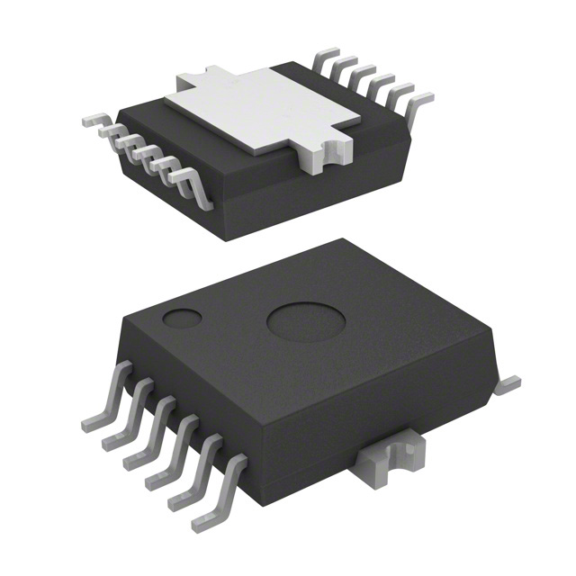
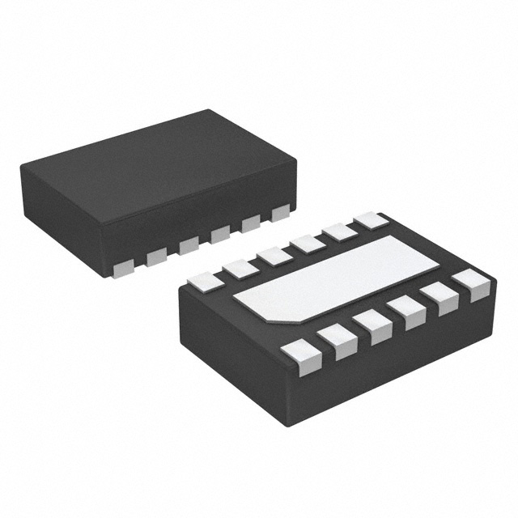
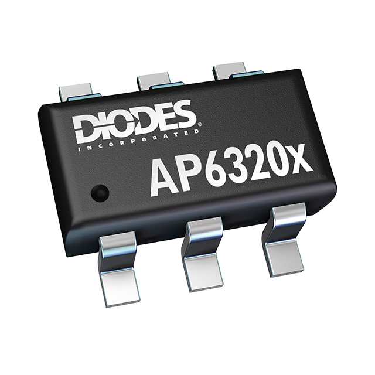
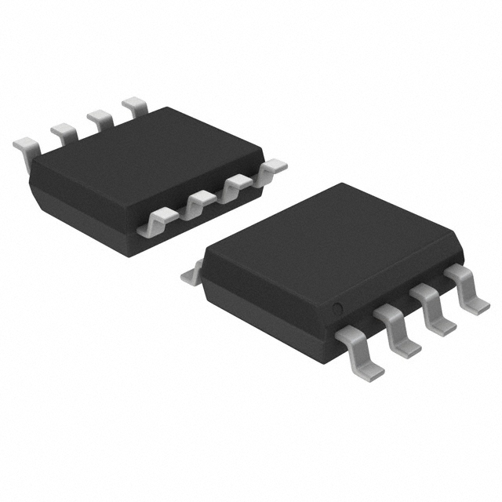
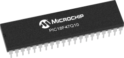
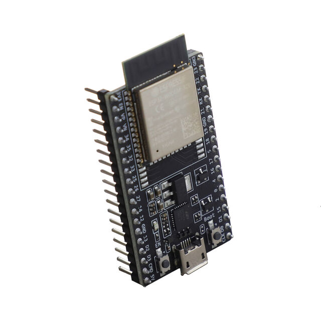
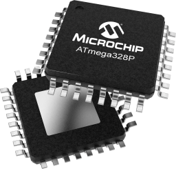
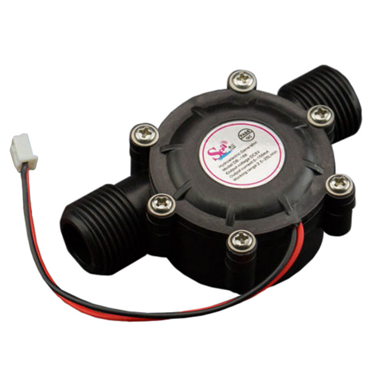
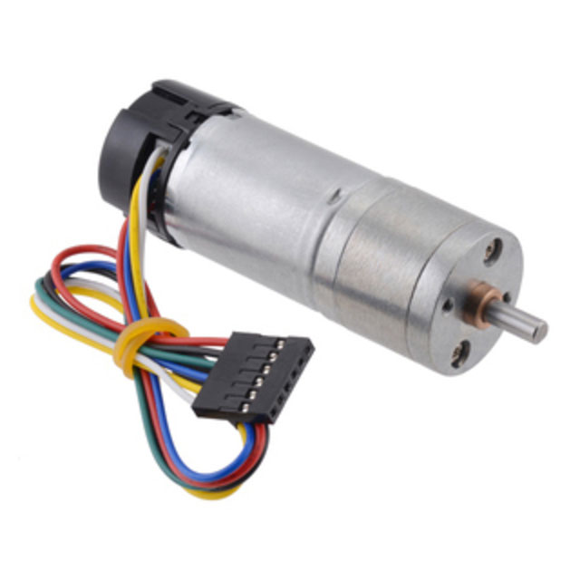
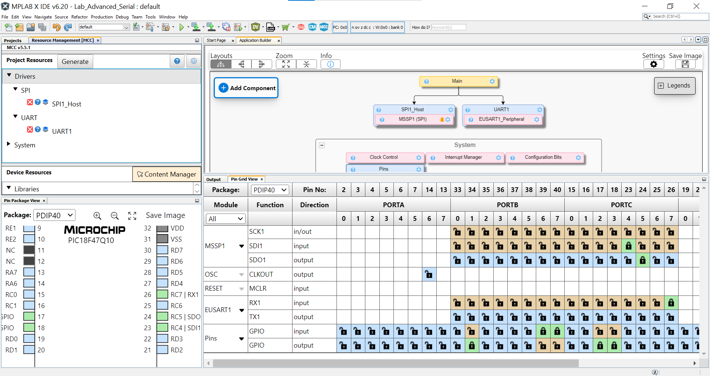

# Major Component Selection & Comparison

## 1. Motor Driver

The motor driver is a critical component for controlling the direction and speed of the motor. Since my design requires bidirectional control of a motor, I needed a motor driver with high efficiency, integrated protection features, and compatibility with my microcontroller. I considered multiple options before finalizing my choice, ensuring that the selected component met my design criteria.

### Component Options

| Component      | Description                                 | Pros                                                                                                                                                                                                                  | Cons                                                                                  | Cost   | Image | Link                         |  
|---------------|---------------------------------------------|----------------------------------------------------------------------------------------------------------------------------------------------------------------------------------------------------------------------|--------------------------------------------------------------------------------------|--------|-------|------------------------------|  
| IFX9201SGAUMA1 | Intelligent motor driver IC                 | - High efficiency, integrated protections, supports bidirectional motor control   - Designed for automotive and industrial applications, ensuring durability   - Compact design with minimal external components | - Higher cost than simpler motor drivers   - Requires careful PCB layout for optimal performance | $4.50  |  | [IFX9201 Datasheet](https://www.infineon.com/dgdl/Infineon-IFX9201SG-DS-v01_01-EN.pdf?fileId=5546d4624cb7f111014d2e8916795dea&ack=t) |  
| DRV8835       | Dual H-Bridge motor driver, supports low voltage | - Compact, efficient, supports PWM   - Simple implementation with minimal external circuitry | - Lower current limit than other options, limiting motor selection   - May require external protection components | $2.50  |  | [DRV8835 Datasheet](https://www.ti.com/general/docs/suppproductinfo.tsp?distId=10&gotoUrl=https%3A%2F%2Fwww.ti.com%2Flit%2Fgpn%2Fdrv8835) |  
| TB6612FNG     | Motor driver with built-in MOSFETs          | - High efficiency, good for small motors, easy to use   - Can drive two motors independently | - Slightly larger footprint   - Lower power handling capability compared to IFX9201 | $3.00  |  | [TB6612FNG Datasheet](https://toshiba.semicon-storage.com/info/TB6612FNG_datasheet_en_20141001.pdf?did=10660&prodName=TB6612FNG) |  

**Chosen Component:** **IFX9201SGAUMA1**

**Rationale:**  
I selected the IFX9201SGAUMA1 motor driver because it offers robust protection features such as overcurrent and thermal protection, making it reliable for my design. Additionally, it supports bidirectional control, which is crucial for my use of a water generator turbine as a reversible motor. Its high efficiency and integrated fault detection make it an optimal choice despite its slightly higher cost.

---

## 2. Voltage Regulator  

The voltage regulator ensures that my microcontroller and other components receive a stable 3.3V power supply. Given my system’s 9V-12V input voltage, I evaluated both linear and switching regulators to determine the best balance between efficiency and simplicity.  

### Component Options  

| Component       | Description                              | Pros                                                                                          | Cons                                                                 | Cost  | Image | Link                           |  
|---------------|------------------------------------------|----------------------------------------------------------------------------------------------|---------------------------------------------------------------------|------|-------|--------------------------------|  
| AP63203WU-7  | Switching regulator, 9V-12V to 3.3V      | - High efficiency (~88-90%), minimal heat dissipation   - Integrated inductor simplifies PCB design   - Compact, reducing board space requirements | - Requires careful layout for optimal performance   - Slightly more expensive than linear regulators | $2.00 |  | [AP63203WU-7 Datasheet](https://www.diodes.com/assets/Datasheets/AP63200-AP63201-AP63203-AP63205.pdf) |  
| MIC4680-3.3   | Switching regulator                      | - High efficiency, small size, better thermal performance   - Reduced power loss, ideal for battery-operated designs | - Slightly complex implementation   - More expensive than linear regulators | $3.50 |  | [MIC4680 Datasheet](https://ww1.microchip.com/downloads/en/DeviceDoc/mic4680.pdf) |  
| MP2359        | Step-down converter                      | - Compact, efficient, good power management   - Works well with higher input voltages | - Requires more external components, increasing PCB complexity   - Design complexity compared to linear regulators | $2.50 |  | [MP2359 Datasheet](https://www.monolithicpower.com/en/documentview/productdocument/index/version/2/document_type/Datasheet/lang/en/sku/MP2359/document_id/228) |  

---

**Chosen Component:** **AP63203WU-7**  

**Rationale:**  
I selected the AP63203WU-7 because it offers high efficiency with minimal heat dissipation, making it ideal for my system’s power requirements. Its integrated inductor reduces PCB complexity, and its compact size helps optimize board space. This component provides a good balance between performance, cost, and ease of implementation.

---

## 3. Microcontroller Selection 

### Component Options  

| Component       | Description                            | Pros                                       | Cons                          | Cost   | Image | Link                           |  
|---------------|----------------------------------------|-------------------------------------------|-------------------------------|------|-------|--------------------------------|  
| **PIC18F47Q10**  | 8-bit microcontroller with multiple I/O | - Supports PWM, UART, and SPI   - Low power consumption | - Limited processing power compared to ARM-based MCUs | $5.00 |  | [PIC18F47Q10 Datasheet](https://www.microchip.com/en-us/product/pic18f47q10) |  
| **ESP32-WROOM-32** | 32-bit microcontroller with WiFi & Bluetooth | - High processing power   - Built-in WiFi/Bluetooth   - Multiple GPIOs and peripherals | - Higher power consumption   - Requires more complex firmware development | $6.50 |  | [ESP32 Datasheet](https://mm.digikey.com/Volume0/opasdata/d220001/medias/docus/754/ESP32-DevKitC_GSG_Ver1.4_2017.pdf) |  
| **ATmega328P** | 8-bit microcontroller used in Arduino | - Low power consumption   - Simple firmware development   - Widely available | - Fewer peripherals compared to ESP32   - Slower processing speed | $3.00 |  | [ATmega328P Datasheet](https://www.microchip.com/en-us/product/atmega328p) |  

My design requires a microcontroller that supports PWM, UART, and SPI communication while offering sufficient GPIOs for motor control and sensor interfacing. After careful evaluation, I selected the **PIC18F47Q10** due to its compatibility with my motor driver and other components.

**Chosen Microcontroller:** **PIC18F47Q10**

This selection ensures efficient communication and control of the motor driver and voltage regulation system, maintaining seamless functionality within the project.

---

## 4. Motor Pump  

In my design, I am repurposing a Motor Pump to function as a bidirectional motor. This choice is based on the need for a compact, efficient motor with built-in water resistance, making it ideal for my application.  

### Component Options  

| Component   | Description                                      | Pros                                                                                         | Cons                                                                                      | Cost   | Image | Link                         |  
|------------|--------------------------------------------------|----------------------------------------------------------------------------------------------|-------------------------------------------------------------------------------------------|--------|-------|------------------------------|  
| SEN0229    | Water generator turbine repurposed as a motor   | - Provides high torque for its size   - Compact, water-resistant, and durable | - Designed primarily as a generator, requiring control adjustments   - Potential efficiency losses when used as a motor | $12.00 |  | [SEN0229 Datasheet](https://mm.digikey.com/Volume0/opasdata/d220001/medias/docus/2546/SEN0229_Web.pdf?_gl=1*evfwiv*_up*MQ..*_gs*MQ..&gclid=Cj0KCQiA2oW-BhC2ARIsADSIAWq7iNMj-RAmBJmdMQBaaXjtzYF8YMNeA7qru75FOjWNWCG2xoZYG8gaAvwaEALw_wcB&gclsrc=aw.ds) |  
| JGA25-371  | DC gear motor with bidirectional control        | - High torque and efficiency   - Compact size with built-in gearbox | - Not inherently water-resistant   - Requires additional sealing for wet environments | $15.00 |  | [JGA25-371 Datasheet](https://mm.digikey.com/Volume0/opasdata/d220001/medias/docus/694/114090047_Web.pdf) |  
| RS-385     | Small brushed DC motor                          | - Affordable and widely available   - Can be used with bidirectional motor drivers | - Lower torque output compared to geared motors   - Not water-resistant | $8.00  |  | [RS-385 Datasheet](https://www.digikey.com/en/htmldatasheets/production/5836911/0/0/1/hc385g-302.html) |  

**Rationale:**  
The SEN0229 is originally designed as a generator but can function as a motor when electrical power is applied. Its robust design and ability to operate in wet environments make it an innovative choice for this application. The IFX9201SGAUMA1 motor driver allows for precise control of the SEN0229 in bidirectional mode, ensuring smooth operation. This approach offers a unique way to utilize an existing component creatively, reducing the need for additional mechanical modifications.

---

## Final Microcontroller Choice & Justification

The **PIC18F47Q10** is the best choice because it provides the necessary communication protocols, PWM control, and sufficient GPIOs to interface with the motor driver and other components. It ensures smooth integration with the IFX9201SGAUMA1 motor driver and the AP63203WU-7 voltage regulator. Additionally, the SEN0229 water generator turbine, when used as a motor, introduces a novel approach to actuation, and the PIC18F47Q10 offers the required control flexibility. This selection balances cost, efficiency, and ease of implementation, ensuring optimal system performance.

---

## Additional Components

Apart from the major components, various small components are incorporated into the design to ensure proper functionality:

- **LEDs** – Used for debugging and status indication.
- **Capacitors** – Used for power stabilization and noise reduction.
- **Resistors** – Used for current limiting and signal conditioning.
- **Diodes** – Provide protection against voltage spikes and reverse polarity.
- **Connectors and Headers** – Facilitate secure connections between components and external interfaces.

These additional components play a vital role in ensuring the stability and reliability of the overall system.

---

## MPLAB Test

---

## Pin Allocation

| Module     | # Available         | Needed | Associated Pins (or * for any)                                  |
| ---------- | ------------------- | ------ | --------------------------------------------------------------- |
| GPIO       | 21                  | 5      | RC_2 , RC_3 , RC_4 , RA_5 , RA_6                                |
| ADC        | 10                  | 0      | ...                                                             |
| UART       | 2                   | 2      | RX-RC_6 , TX-RC_7                                               |
| SPI        | 2                   | 2      | SI-RC_4 , SO-RC_5                                               |
| I2C        | 2                   | 0      | ...                                                             |
| PWM        | ?                   | ?      | ...                                                             |
| ICSP       | 3                   | 3      | RB-6,RB-7,MCLR                                                  |
| ...        | ...                 | ...    | ...                                                             |

---

## Power Budget

[Power Budget ](https://docs.google.com/spreadsheets/d/156U78wOTZNQjrQSCz7AoKw_OFbUZ7FwH/edit?usp=sharing&ouid=107614409505094169035&rtpof=true&sd=true)
