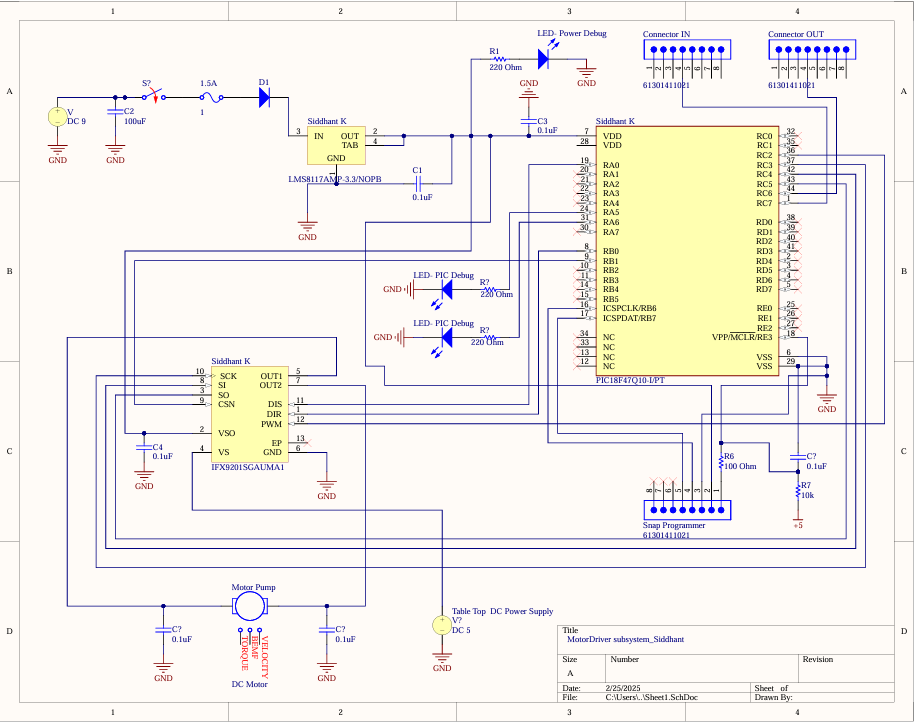
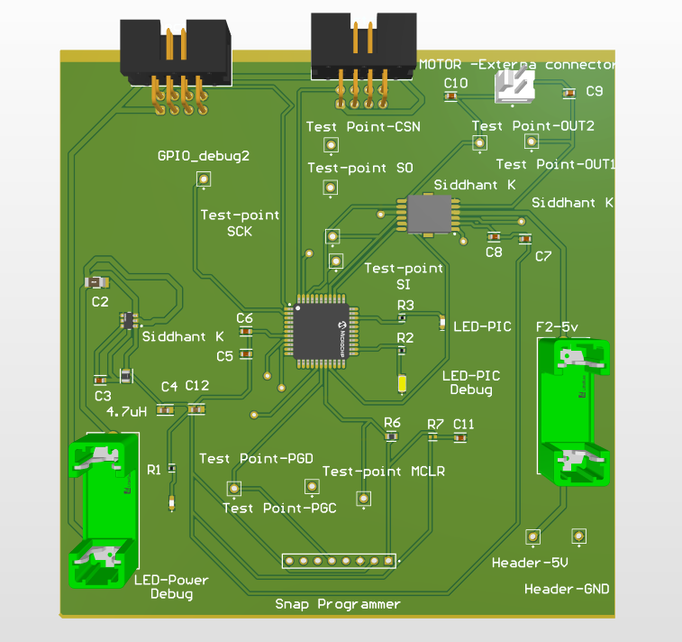
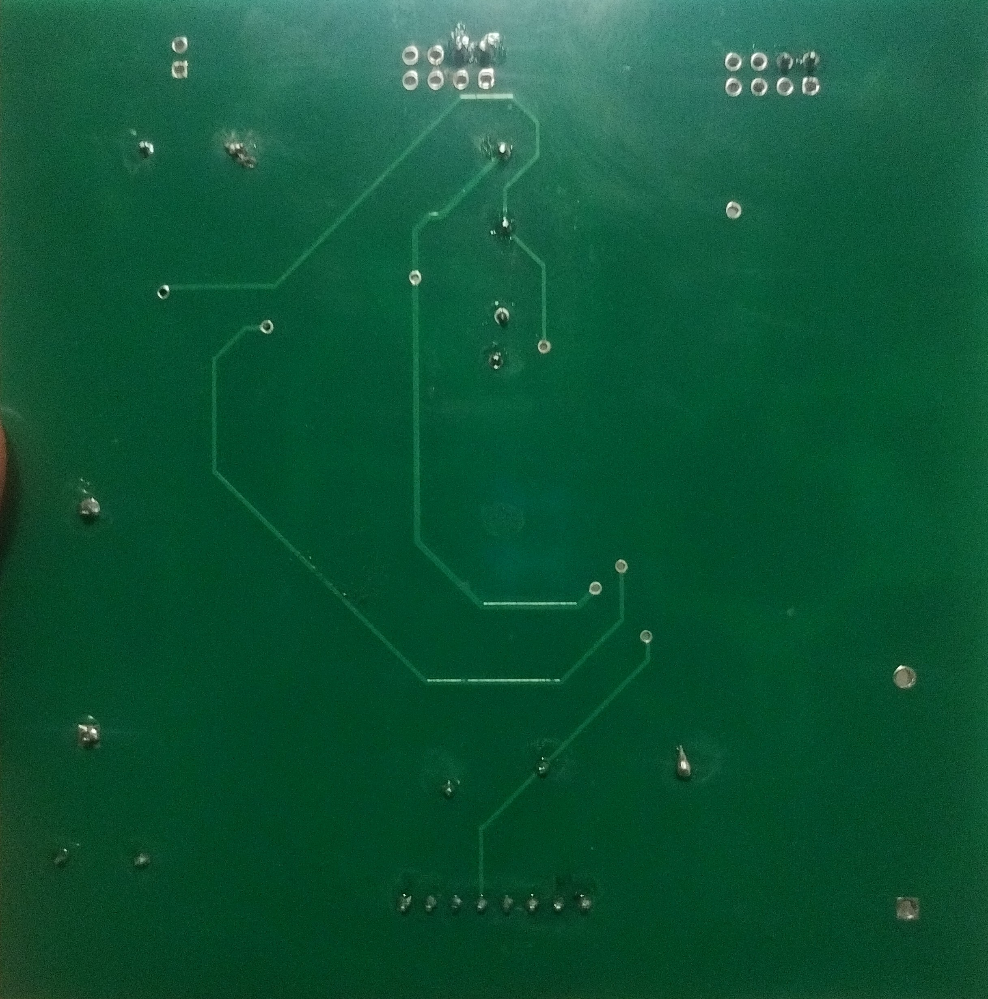

# Motor Driver Subsystem – Schematic

## 🧩 Overview
This document offers a complete and expanded technical explanation of the hardware design for the Motor Driver Subsystem. The design is intended for use in a multi-subsystem embedded system project that coordinates sensor readings, real-time control, and remote monitoring via MQTT. This motor subsystem receives commands over UART, processes them on a PIC18F47Q10 microcontroller, and sends SPI-based control signals to an IFX9201SGAUMA1 motor driver IC.

---

## 📷 Final Schematic

---

## 🛠️ Final PCB 

---

## 📂 Design Files
- ✅ Final ECAD Altium Project (.SchDoc, .PcbDoc)
- ✅ Gerber Files for PCB Fabrication (.zip)
- ✅ Bill of Materials (BOM in CSV/Excel format)

➡️ [Final_Altium_PCB.zip](./Motor_Subsystem.zip)  
➡️ [Motor_Subsystem_Gerbers.zip](./SK_Gerber.zip)  
➡️ [Motor_BOM.csv](./Motor_BOM.csv)

---

## ✅ Functional Analysis: How This Meets System Requirements

This motor driver hardware fulfills the EGR 314 embedded systems design project requirements by providing:

1. **Subsystem Modularity:** The motor subsystem was intentionally designed to operate independently within the larger system architecture by leveraging UART and SPI protocols. It receives commands via UART from Sanjit’s Web subsystem and simultaneously uses SPI to issue motor control commands to the IFX9201 driver. This separation of responsibilities allows the subsystem to forward unrelated messages (daisy-chain protocol), ensuring scalability. In future systems, new nodes could be added to the UART chain without breaking existing communication, maintaining modularity and reducing integration complexity.

2. **Accurate Actuation:** The use of the IFX9201SGAUMA1 motor driver IC enables precise bidirectional control through digital SPI commands instead of noisy analog signals. This ensures consistent behavior across all motor states (forward, reverse, off) without relying on duty cycle modulation. SPI’s inherent noise immunity and deterministic command structure reduce timing uncertainties and electromagnetic interference (EMI), leading to smoother and more reliable motor transitions. This precision is essential when integrating with time-sensitive feedback systems, such as thermal regulation based on sensor input.

3. **Real-time Responsiveness:** The PIC18F47Q10 is configured to continuously listen to the UART line using interrupt-driven or polling-based logic, depending on project constraints. Once a valid message addressed to 'S' (motor subsystem) is received and verified, it is parsed and acted upon immediately. This ensures real-time responsiveness to changing conditions or user inputs. For instance, when Sanjit sends a message like FSTS03FS, the motor subsystem reacts without noticeable delay, making the system suitable for use in interactive or reactive control environments.

4. **Status Transparency:** Every time the motor changes state, the subsystem sends out two separate UART messages to Kevin (HMI) and Sanjit (cloud logger) to keep both endpoints updated. These messages follow the same 8-byte protocol and indicate whether the motor is off, forward, or reverse. This dual-broadcast design ensures visibility across human and server interfaces, fulfilling the project’s requirement for feedback-driven control. It also facilitates debugging and monitoring by making all system state changes observable in real-time from multiple vantage points.

5. **Safe Operation:** The power system was engineered with safety and durability in mind. A resettable fuse limits input current and prevents board damage in case of short circuits or overvoltage. The AP63203WU buck regulator efficiently steps down voltage while minimizing heat, ensuring that both the MCU and motor driver operate within safe electrical tolerances. Additional decoupling capacitors reduce power ripple and prevent brownouts during state transitions. These hardware choices collectively make the subsystem robust for repeated lab usage and potential deployment in field prototypes.

---

## 🧠 Design and Decision Process 

Designing this subsystem required careful evaluation of electrical, mechanical, and communication needs. Below is a breakdown of each major decision with reasoning to show why each component was chosen over alternatives.

### 1. Microcontroller Selection – PIC18F47Q10
We selected the PIC18F47Q10 because it offers a highly capable yet accessible feature set suitable for embedded control applications. Its dual UART and SPI peripherals were critical for our architecture, which relies on UART-based daisy-chained communication and SPI-based motor control. Unlike the ATmega328, which only supports one UART and has limited flash and RAM, the PIC18F47Q10 supports advanced communication, larger memory, and a more robust interrupt system. Compared to STM32 alternatives, it allowed us to stay within the MPLAB X ecosystem, which we were already proficient in, and use the MCC tool to autogenerate peripheral setup and reduce code errors. This decision minimized our development time and lowered the barrier for other teammates who might need to interface with the MCU.

### 2. Motor Driver IC – IFX9201SGAUMA1
We chose the Infineon IFX9201SGAUMA1 over more common motor drivers like the L298N and DRV8833 due to its efficient digital interface and low-loss switching behavior. While L298N requires PWM signals and introduces voltage drops that reduce motor torque, the IFX9201 allows full-bridge control via SPI commands, eliminating analog signal inconsistencies. This digital control approach meant we could integrate the motor logic cleanly into firmware and synchronize motor commands precisely with UART message reception. The IFX9201 also includes built-in protections like current limiting and thermal shutdown, making it safer and more reliable under variable load conditions. The IC’s compact form factor further helped reduce board size and routing complexity.

### 3. Power Architecture – AP63203WU Buck Regulator
Our power supply architecture was designed for efficiency, reliability, and robustness. We used the AP63203WU buck regulator to step down 9–12V DC input to a stable 5V output for both the microcontroller and motor driver. Unlike linear regulators such as the AMS1117, which waste power as heat, the buck converter maintains high efficiency even at higher currents. This was particularly important for our subsystem, which includes high-current motor outputs. The AP63203WU was chosen for its compact footprint, internal compensation, and ability to supply over 2A of current. A resettable polyfuse was added in series before the converter to protect against short circuits or current spikes. Together, these choices ensured that our hardware would run cool, stable, and safely even in extended lab tests or real-world deployments.

### 4. Debug Features
Effective debugging was one of our top priorities due to the real-time nature of motor control. To aid in hardware verification and runtime debugging, we included LED indicators on the board to reflect motor state (OFF, FORWARD, REVERSE) and power status. This provided immediate visual feedback, especially useful when testing UART messages or SPI commands. Additionally, we routed test points for all critical lines, including CS, MOSI, SCK (SPI), and RX/TX (UART), allowing easy access for logic analyzers or oscilloscopes. These additions were especially useful when troubleshooting message corruption, SPI timing mismatches, or unexpected motor behavior. By investing in built-in debugging aids, we significantly reduced development time and made it easier to perform low-level signal analysis during integration with other subsystems.

### 5. Connector and Layout
We designed our PCB layout to prioritize safety, modularity, and noise isolation. For high-current paths like motor outputs, we used screw terminal blocks instead of header pins to provide secure and solderless wire connections. These terminals could handle the expected motor current without risk of disconnection or overheating. To reduce electromagnetic interference (EMI), the PCB was zoned into distinct regions: power input and regulation, logic/control (microcontroller + SPI), and motor output. This separation reduced signal coupling and made the board easier to debug and modify. Key capacitors were placed close to the motor driver and MCU power pins to suppress voltage ripple and prevent logic faults. The layout also left space for future version enhancements, such as adding UART programming headers or external sensors.

---

## 🔄 Version 2.0 Hardware Design Plan

If a second version were to be developed, we would improve the design with the following upgrades:

1. **Onboard Debug Interface**  
   - AOne of the main bottlenecks during firmware testing was the dependency on an external ICSP programmer and serial debug tools. A USB-to-UART converter (like CH340C or FT232RL) could be integrated directly onto the board, providing a plug-and-play debug console without needing specialized hardware. This would reduce development time and make the system more self-contained and field-deployable—especially useful in educational or prototype deployments where rapid iteration is necessary.

2. **Improved Silkscreen and Labeling**  
   - While the test points and terminals are functional, their current labeling lacks visibility under time pressure or when shared across team members. Adding a detailed silkscreen with clear labels like "TP-SCK", "TP-MOSI", or "UART-RX" directly on the PCB would drastically improve usability during validation. These labels would help avoid wiring errors, enable quicker handoffs between teammates, and support better documentation alignment with the schematic and firmware.

3. **Enhanced EMC Protection**  
   -In Version 1.0, basic filtering was handled through bypass capacitors, but higher-frequency transients can still interfere with UART and SPI communications. Adding TVS diodes to key lines (especially UART RX/TX and SPI SCK) would protect the MCU against electrostatic discharge (ESD) or voltage spikes. Series resistors and RC snubbers could also be implemented for SPI lines to prevent ringing and improve signal integrity in longer trace configurations.

4. **Thermal Optimization**  
   - Although thermal performance was acceptable under lab testing, future versions could be improved by relocating the buck regulator to minimize trace length between high-current input and output paths. This would reduce IR losses and heat generation. Adding copper pour areas and thermal vias underneath the regulator and driver ICs would improve heat dissipation. These improvements would make the board more resilient under higher motor loads or in environments with limited airflow.

5. **Bootloader Support**  
   - To enhance flexibility during software updates, we would add a UART bootloader circuit selectable via jumper. This would allow firmware reprogramming directly via serial interface without needing ICSP. During development or future iterations, updates could be deployed through a terminal or script, supporting faster cycles and better accessibility for non-Microchip environments. It also aligns with good design practice for modular embedded systems that may evolve post-deployment.

---

## 🔍 5W Justification

### **What**
A compact embedded motor controller that responds to UART messages and issues motor state changes using SPI, while ensuring real-time feedback and robust power delivery.

### **Why**
The project required a modular, real-world implementable actuator system. This subsystem meets the requirement by providing hardware-level motor control, a reliable UART communication handler, and a minimalistic SPI-based design that simplifies MCU load.

### **When**
This design was finalized in April 2025 after multiple prototype iterations and integrated lab testing with the Sensor, Web, and HMI subsystems. The schematic reflects the third major version of the hardware design.

### **Where**
Implemented fully on a 2-layer custom PCB using Altium Designer, hosted as part of the team GitHub repository. Interfaces with external UART and motor connections for plug-and-play testing.

### **How**
- System is powered via DC jack through a fuse into a buck regulator.
- The PIC continuously listens for UART frames, validates headers and IDs.
- When a valid command is detected (e.g., “FSTS02FS”), it triggers a matching SPI command to the IFX9201 (e.g., 0b11101111 for FORWARD).
- Motor driver updates are broadcasted back to the Web (T) and HMI (K).

---

## ✅ Final Summary

This hardware design meets all project criteria for an actuator subsystem. It enables precise motor control, seamless integration with other UART-based components, and feedback mechanisms. Designed with practical manufacturing and testing in mind, it also forms a solid foundation for future field-deployable embedded systems.

